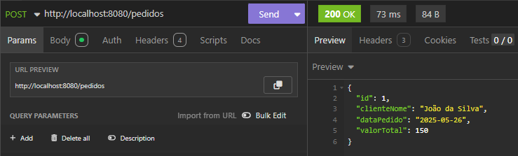
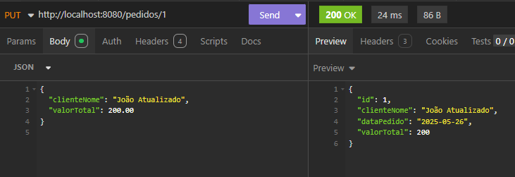
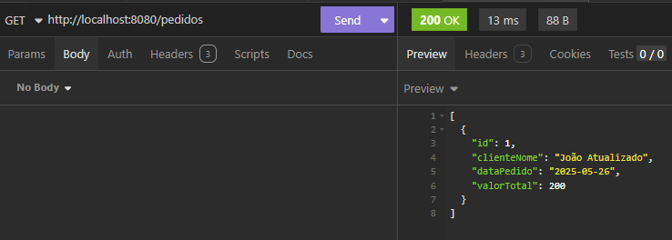
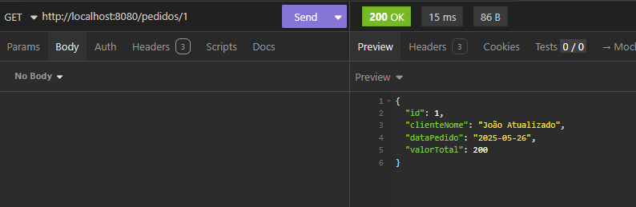
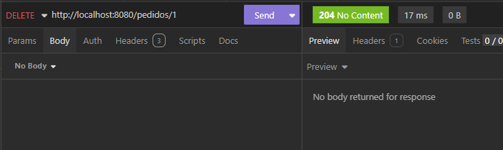

Segue um modelo de **README.md** com os prints que você forneceu, explicando os testes realizados na API REST de pedidos:

---

# API de Pedidos - Testes com Inmonia (Insomnia)

Esta API REST permite o gerenciamento de pedidos com operações de criação, leitura, atualização e exclusão. Abaixo estão os testes realizados via [Inmonia](https://inmonia.rest/) (ou Insomnia/Postman) com exemplos reais.

## Endpoints testados

---

### ✅ **POST** `/pedidos`

Cria um novo pedido.

📥 **Corpo da requisição:**

```json
{
  "id": 1,
  "clienteNome": "João da Silva",
  "dataPedido": "2025-05-26",
  "valorTotal": 150
}
```

📸 **Resposta 200 OK:**



---

### 🔄 **PUT** `/pedidos/1`

Atualiza o nome do cliente e o valor total do pedido com ID 1.

📥 **Corpo da requisição:**

```json
{
  "clienteNome": "João Atualizado",
  "valorTotal": 200.00
}
```

📸 **Resposta 200 OK:**



---

### 🔍 **GET** `/pedidos`

Retorna todos os pedidos.

📸 **Resposta 200 OK:**



---

### 🔍 **GET** `/pedidos/1`

Retorna o pedido com ID 1.

📸 **Resposta 200 OK:**



---

### ❌ **DELETE** `/pedidos/1`

Remove o pedido com ID 1.

📸 **Resposta 204 No Content:**



---

## 🧪 Conclusão

Todos os testes foram realizados com sucesso, demonstrando que a API está funcional para as operações básicas de CRUD. Os testes foram realizados no dia **26/05/2025** com a ferramenta Inmonia, e os prints comprovam o funcionamento correto da aplicação.

---

Se quiser, posso empacotar este README com os prints em uma pasta zipada. Deseja isso?
